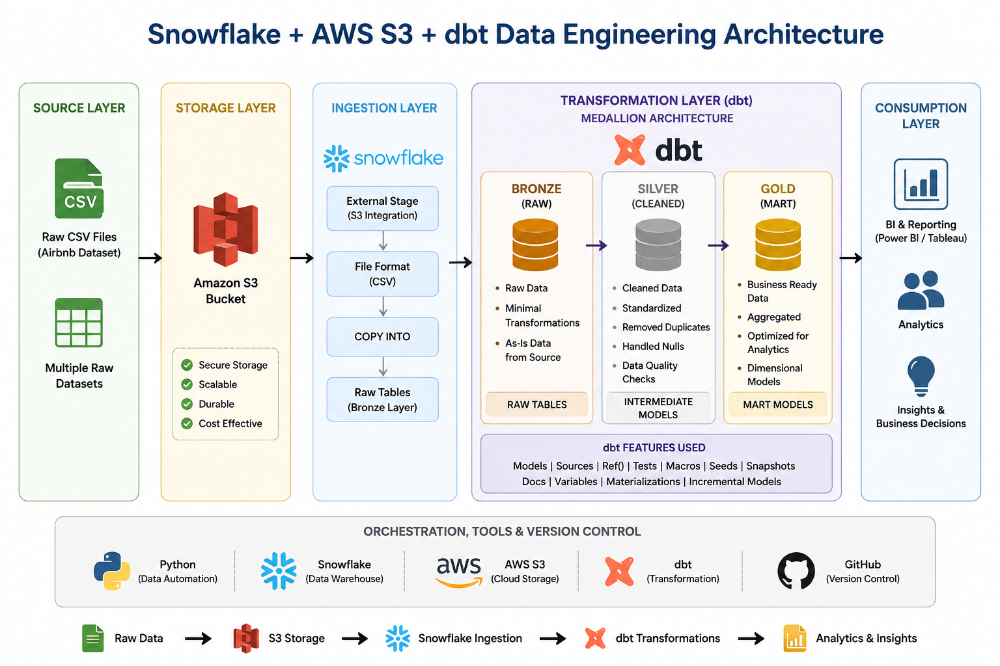

# Snowflake + AWS S3 + dbt Data Engineering Project


## Overview

This project demonstrates an end-to-end **ELT (Extract, Load, Transform)** pipeline using **AWS S3**, **Snowflake**, **dbt**, and **Python**.

Raw Airbnb datasets are uploaded to Amazon S3, ingested into Snowflake using an External Stage and `COPY INTO` command, transformed using dbt following the **Medallion Architecture (Bronze → Silver → Gold)**, and prepared for analytics and reporting.

The project demonstrates modern cloud data engineering practices including cloud storage, data warehousing, SQL transformations, modular data modeling, testing, documentation, and version control.

---

# Architecture

<p align="center">
  
</p>

---

## Technology Stack

| Category | Tools |
|----------|-------|
| Cloud Storage | AWS S3 |
| Data Warehouse | Snowflake |
| Data Transformation | dbt Core |
| Programming | Python |
| Query Language | SQL |
| Version Control | Git & GitHub |
| Environment Manager | uv |

---

# Architecture Components

| Component | Purpose |
|-----------|---------|
| AWS S3 | Stores raw Airbnb CSV files |
| Snowflake Storage Integration | Secure connection between Snowflake and AWS |
| External Stage | Reads files directly from S3 |
| COPY INTO | Loads raw data into Snowflake |
| Bronze Layer | Raw loaded data |
| Silver Layer | Cleaned and standardized data |
| Gold Layer | Business-ready analytical tables |
| dbt | Data transformations and testing |
| Python | Utility scripts and automation |

---

# Data Pipeline Workflow

```text
Raw Airbnb CSV Files
          │
          ▼
      Amazon S3
          │
          ▼
Snowflake Storage Integration
          │
          ▼
    External Stage
          │
          ▼
      COPY INTO
          │
          ▼
 Bronze (Raw Tables)
          │
          ▼
Silver (Staging Models)
          │
          ▼
Intermediate Models
          │
          ▼
 Gold (Mart Models)
          │
          ▼
 Analytics / Reporting
```

---

# Project Structure

```text
Airbnb_Snowflake_DBT_Data_Engineer_Project/
│
├── images/
│   └── a_clean_infographic_diagram_on_a_white_background.png
│
├── SourceData/
│   ├── listings.csv
│   ├── calendar.csv
│   └── reviews.csv
│
├── aws_dbt_snowflake_project/
│   ├── analyses/
│   ├── logs/
│   ├── macros/
│   ├── models/
│   │   ├── staging/
│   │   ├── intermediate/
│   │   └── marts/
│   ├── seeds/
│   ├── snapshots/
│   ├── target/
│   ├── tests/
│   ├── dbt_project.yml
│   ├── packages.yml
│   └── profiles.yml
│
├── main.py
├── pyproject.toml
├── uv.lock
├── .python-version
├── .gitignore
└── README.md
```

---

# Dataset

The project uses Airbnb datasets containing information such as:

- Listings
- Reviews
- Calendar Availability
- Pricing Information
- Hosts
- Locations

The datasets are uploaded to **Amazon S3** before being ingested into Snowflake.

---

# ELT Process

## Step 1 — Upload Data

Upload raw CSV files to an Amazon S3 bucket.

---

## Step 2 — Configure Snowflake

- Create Warehouse
- Create Database
- Create Schema
- Create Storage Integration
- Create File Format
- Create External Stage

---

## Step 3 — Load Data

Load raw data using

```sql
COPY INTO table_name
FROM @stage_name;
```

---

## Step 4 — Transform Data using dbt

Transformations include:

- Removing duplicate records
- Handling NULL values
- Standardizing column names
- Data type conversions
- Filtering invalid records
- Business rule implementation
- Creating surrogate keys
- Incremental loading

---

## Step 5 — Build Analytical Models

The project follows the Medallion Architecture.

### Bronze Layer

- Raw Data
- Minimal transformations

### Silver Layer

- Cleaned Data
- Standardized Data
- Quality Checks

### Gold Layer

- Fact Tables
- Dimension Tables
- Reporting Tables

---

# dbt Concepts Used

- Models
- Sources
- ref()
- source()
- Macros
- Variables
- Incremental Models
- Materializations
- Seeds
- Snapshots
- Documentation
- Tests

---

# Data Quality Tests

The project implements dbt tests including:

- Unique Tests
- Not Null Tests
- Accepted Values Tests
- Relationship Tests
- Custom SQL Tests

---

# Features

- End-to-End ELT Pipeline
- AWS S3 Integration
- Snowflake Cloud Data Warehouse
- dbt Data Modeling
- Modular SQL Transformations
- Automated Data Quality Tests
- Documentation Generation
- Git Version Control
- Reproducible Python Environment using uv

---

# Skills Demonstrated

- Data Engineering
- SQL
- Snowflake
- AWS S3
- dbt
- Python
- ELT Pipelines
- Medallion Architecture
- Cloud Data Warehousing
- Data Modeling
- Data Quality Testing
- Git & GitHub

---

# Getting Started

## Clone Repository

```bash
git clone https://github.com/SwapnilNarwade1203/Airbnb_Snowflake_DBT_Data_Engineer_Project.git
```

---

## Install Dependencies

Using uv

```bash
uv sync
```

or

```bash
pip install -r requirements.txt
```

---

## Run Python Scripts

```bash
uv run python main.py
```

---

## Run dbt

```bash
dbt debug
dbt deps
dbt seed
dbt run
dbt test
dbt docs generate
dbt docs serve
```

---

# Future Improvements

- Snowpipe for Automated Ingestion
- Apache Airflow Orchestration
- CI/CD Pipeline with GitHub Actions
- Power BI Dashboard
- Incremental Data Loading
- Data Observability
- Monitoring & Alerting

---

# Author

**Swapnil Narwade**

**GitHub**

https://github.com/SwapnilNarwade1203

**LinkedIn**

https://www.linkedin.com/in/swapnilnarwade1203/

---

# License

This project is intended for educational purposes, hands-on learning, and portfolio demonstration.
